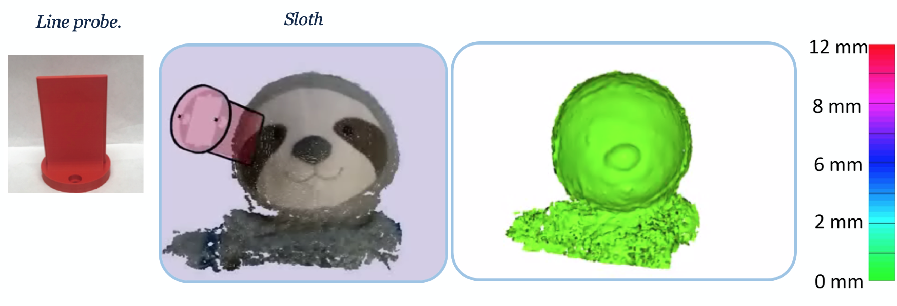
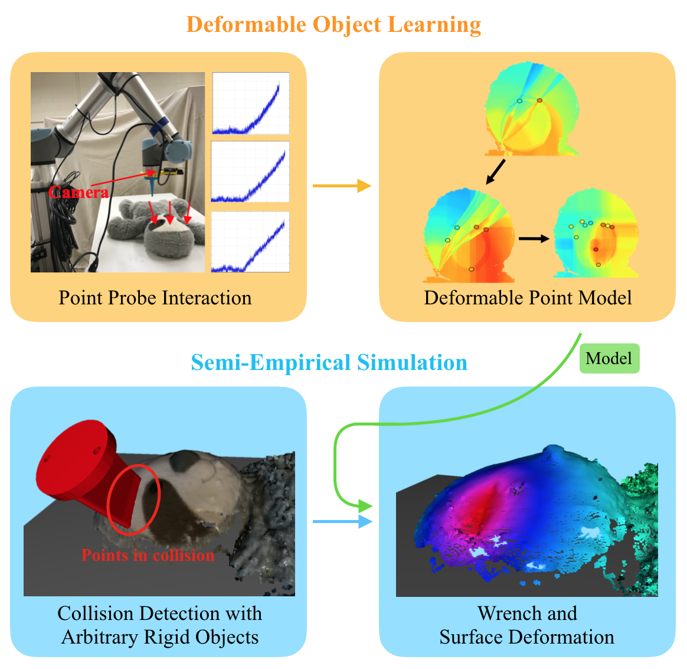

# Deformable-Modeling
A semi-empirical method for simulating contact with elastically deformable objects whose force response is learned using entirely data-driven models.



## System Overview

A point interaction model of a deformable object is first learned through data acquired with the system shown here after a small number of pokes. The model is then used in a semi-empircal simulator that solves for the deformation and contact wrench with an arbitrary rigid object. The color of the deformed object represents the amount of surface deformation.

## Getting started
### Requirements

  * Hardware:

    - Robots with with force sensors (e.g. UR5e)  
    - A computer with a dedicated GPU(recommended)
    - RGB-D Camera (e.g. Intel SR300)
    - Probes

  * OS:  Ubuntu 16.04

  * Environment:

    - Python 2.7 / Python 3.5
    - Klamp't
    - Open3D

### Installation

Simply git clone the project and check all the dependent libraries.

### Calibration
First, do camera calibration to make the system work correctly. You can do all when connecting the robot.
```
cd experiment
python calibration_testing.py
```
or
```
cd utils
python calibration_calculation.py
python generate_marker_transform_color.py
```
then connect robot
```
python take_calibration_pictures
```

### Executing
simply run
```
python main.py --process [process-name]
```

**or (recommend)**

check`config.py`, set `self.use_mkdir_exp = True` , then 

```
python main.py --process debugging --step y --probe point 
```

## Version

- 2019.07.16 First version.
- 2019.07.19 Add line probe mode, add transform from probe to EE, fix unit vector bug.
- 2019.07.21 Add duplicates removing, collision detection, and fix point cloud order.
- 2019.07.23 Change line poking process: first reconstruct a probe list then poke. fix some vis bugs.
- 2019.07.24 Speed up getting pcd, test all process in physical, update data format, add future folder (2 camera in thread)
- 2019.08.13 Update the final version and data set.
- 2020.07.05 Update analysis, models, simulation, and data. Delete future foler. Reagrrange codes.
